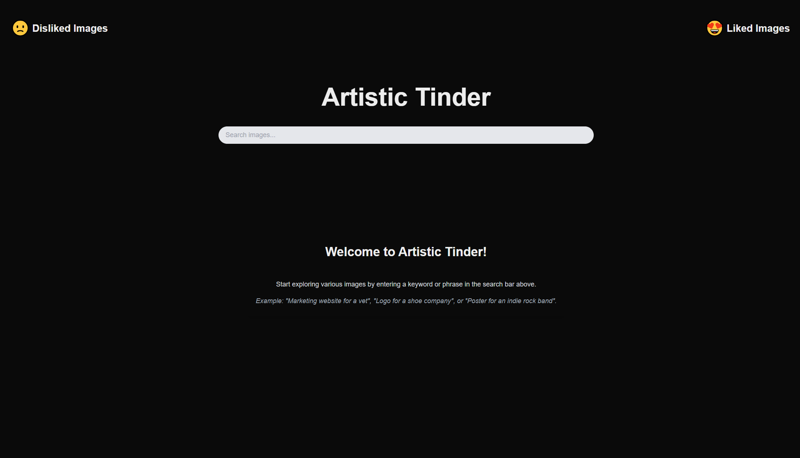
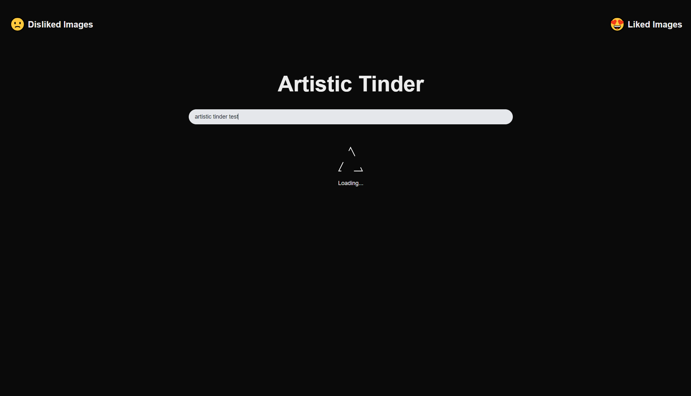
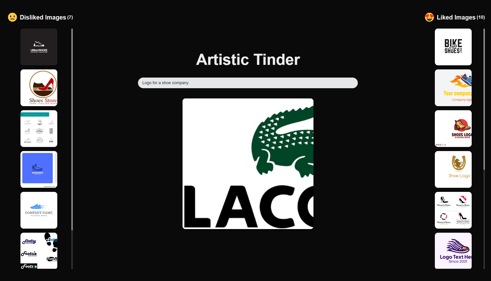
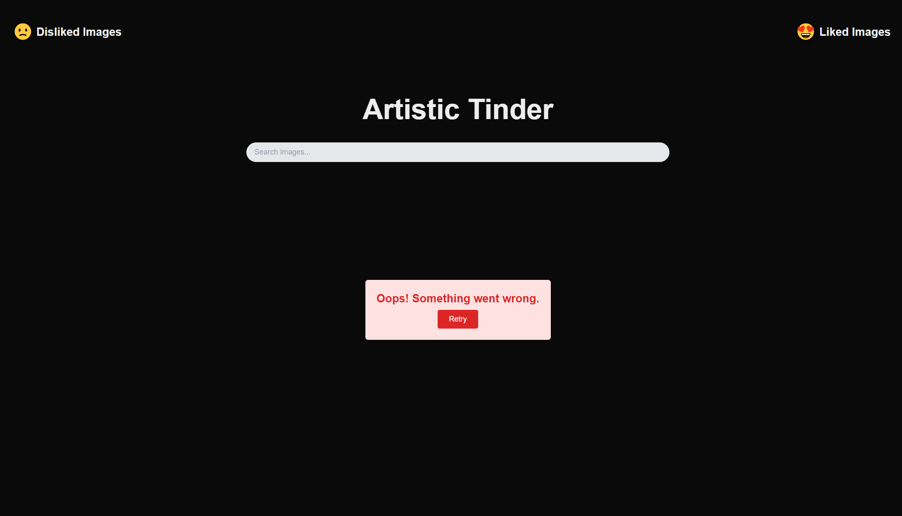
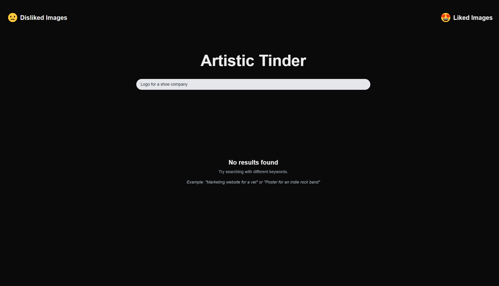

# Artistic Tinder

## Project Overview

**Artistic Tinder** is a web application built using **Next.js** and **TypeScript**, designed to help users explore different images based on search queries. The app allows users to **like** or **dislike** images (swiping right or left). Users can search for images such as logos, website designs, posters, and more, and browse through the results with smooth swipe interactions.

The project uses **SerpAPI** to fetch images from Google Image search, providing relevant images based on the user's query. The application also handles various states, such as loading, error, and no results found, ensuring a smooth and intuitive user experience.

---

## Features

- **Search for Images**: Users can search for various images using keywords like "Logo for a shoe company" or "Marketing website for a vet."
- **Swipe to Like or Dislike**: Users can swipe right to like an image or swipe left to dislike.
- **Responsive and User-Friendly UI**: The app provides a simple and responsive interface with clean animations and smooth interactions.
- **Loading and Error Handling**: Displays a loading message while fetching images and provides a retry option if an error occurs.
- **No Results Handling**: Displays a message with suggestions if no images are found for the given search query.

## Setup and Installation

To run this project locally, follow these steps:

### 1. Clone the Repository

```bash
git clone https://github.com/nikdev27/artistic-swipe.git
cd artistic-tinder
```

### 2. Install Dependencies
Install the necessary dependencies using npm or yarn:
```bash
npm install
# or
yarn install
```

### 3. Set Up Environment Variables
You will need a SerpAPI key to fetch images from Google Image search. Sign up for an API key here.

Once you have the API key, create a .env.local file in the root directory and add the following:
```bash
npm install
# or
yarn install
```

### 4. Run the Development Server
Now, you can run the app locally:
```bash
npm run dev
# or
yarn dev
```
The app will be available at http://localhost:3000.

### 5. Build for Production
To build the app for production, run the following command:
```bash
npm run build
# or
yarn build
```
Once built, you can start the server:
```bash
npm run build
# or
yarn build
```

## Project Structure

```
artistic-tinder/
├── app/
│   ├── api
│   │   └── open-ai
│   │   │   └── route.ts            # API to integrate OpenAI
│   │   └── search
│   │       └── route.ts            # API to integrate SerpAPI
│   ├── 404.tsx                     # Not Found page
│   ├── favicon.ico                 # Favicon for the app
│   ├── globals.css                 # Global styles using TailwindCSS
│   ├── layout.tsx                  # Layout component for main page
│   └── page.tsx                    # Main page component that integrates the search, image list, and swipe functionalities
├── components/
│   ├── ImageCard.tsx               # Component to display individual image cards
│   ├── ImageCardsContainer.tsx     # Component that handles the list of images and different states (loading, error, no results)
│   └── SearchBar.tsx               # Search bar component where users input their queries
├── lib/
│   ├── openAiAPI.ts                # API call logic for getting recommended chips from openAI
│   └── serpAPI.ts                  # API call logic for fetching images using SerpAPI
├── utils/
│   ├── consts.ts                   # Consts for prompt message
│   ├── enums.ts                    # Enums for serpAPI and OpenAI API
│   └── types.ts                    # TypeScript types and interfaces for API responses and components
├── .env.development                # Environment variables for development mode (for API keys)
├── .env.production                 # Environment variables for production mode (for API keys)
├── package.json                    # Package configuration and dependencies
└── README.md                       # Documentation for the project
```

---

## Technologies Used

- **Next.js**: A powerful React framework for building server-rendered web applications.
- **TypeScript**: TypeScript was used to add static type checking, making the code more maintainable and less error-prone.
- **TailwindCSS**: For modern, responsive, and utility-first CSS styling.
- **SerpAPI**: A Google Image search API used to fetch images based on the user’s search query.
- **ReactTinderCard**: For handling sw*ipe gestures to like or dislike images.
- **OpenAI**: For repopulating the list of candidate images based on how users had already swiped.

---

## Design and Architecture

- I used Next.js framework with server-less architecture. SerpAPI and OpenAI APIs should not be used on browser. So I selected Next.js framework.
- I used create-next-app to create this application.
- I didn't implement unnecessary structure to avoid over-engineering.
- And I didn't use any complex or heavy UI libraries or templates to reduce loading time and improve project performance.

---

## Extra Credit: Recommendation Engine 🚀

- I implemented this functionality by using OpenAI service.
- Used liked images and disliked images as input data.
- Build prompt configuration to get recommended chips from input data.
- Get chips from this service, and called SerpAPI with user query and these chips to get more images similar to the likes, less similar to the dislikes.

---

## Screenshots

### Before Search:


### During Loading:


### Search Page:


### Error State:


### No Results Found:


---

## Future Improvements
Image Recommendations: Implement a recommendation system that shows more images similar to the ones the user likes.
